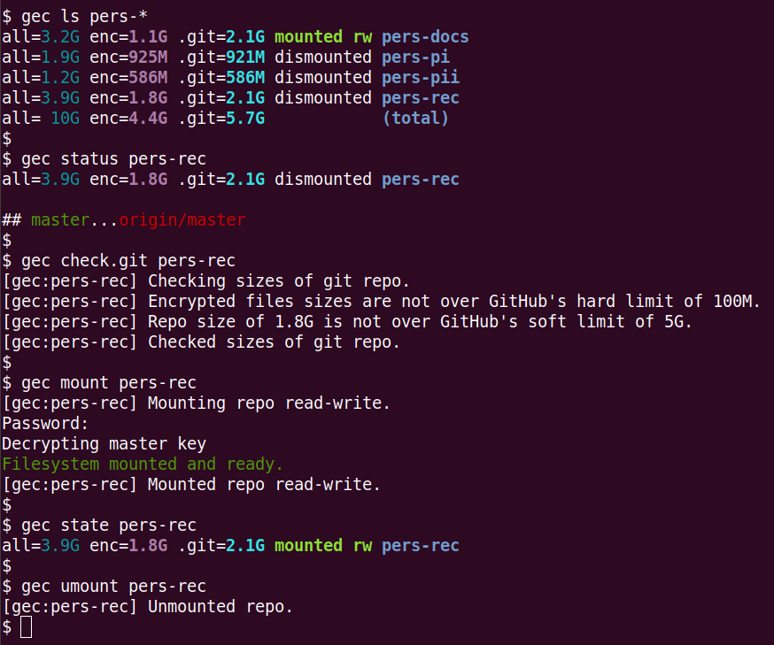

# gec

**`gec`** is a command-line utility written in Bash with convenience commands for using [gocryptfs](https://github.com/rfjakob/gocryptfs) with git.
It refrains from doing anything clever, making it possible to naively fallback to the underlying gocryptfs or git commands if a need should arise.

It transparently uses data encryption, both at rest and on the remotes. It uses version control and leverages redundant remote storage.
Many of the implemented commands support GitHub and GitLab. Git users will be at home with it.

> **:warning: Before continuing, save the link to the official [Gitee mirror](https://gitee.com/impredicative/gec) of this repo.**

## Contents
* [Screenshot](#screenshot)
* [Links](#links)
* [Limitations](#limitations)
* [Requirements](#requirements)
* [Installation](#installation)
* [Development](#development)
* [Setup](#setup)
* [Directories](#directories)
* [Workflow](#workflow)
* [Commands](#commands)

## Screenshot


## Links
| Caption   | Link                                          |
|-----------|-----------------------------------------------|
| Repo      | https://github.com/impredicative/gec          |
| Changelog | https://github.com/impredicative/gec/releases |
| Mirror    | https://gitee.com/impredicative/gec           |

## Limitations
The known applicable size [limits](https://stackoverflow.com/a/59479166/) are tabulated below.
If a hard limit is violated during a `commit`, `gec` will attempt to check it and error early, otherwise a `push` will simply fail.

| Size of | SI Value | Type | Enforcer | Action by `gec` |
|---------|----------|------|----------|-----------------|
| File    | 100M     | Hard | GitHub   | Error           |
| Push    | 2G       | Hard | GitHub   | Error           |
| Repo    | 5G       | Soft | GitHub   | Warning         |
| Repo    | 10G      | Hard | GitLab   | Error           |

Due to the use of the gocryptfs `-sharedstorage` option, a hardlink cannot be created in a decrypted repo.

## Requirements
Linux is required along with a few tools which are covered in the [**Installation**](#installation) section.

A dedicated [GitHub](https://github.com/) and [GitLab](https://gitlab.com/) account is required with an identical username on both sites!
If using Firefox, the [Multi-Account Containers](https://addons.mozilla.org/en-US/firefox/addon/multi-account-containers/) add-on can be very useful.

## Installation
These steps were tested on Ubuntu. On other distros, ensure that the executables are available in the PATH.

Ensure `curl` ≥7.74.0, `git` ≥2.25.1, [`jq`](https://github.com/stedolan/jq/releases) ≥1.5:
```shell
sudo apt install curl git jq
```

Install [`gocryptfs`](https://github.com/rfjakob/gocryptfs/releases) ≥2.2.1:
```shell
RELEASE=$(curl https://api.github.com/repos/rfjakob/gocryptfs/releases | jq -r .[0].tag_name)
wget -qO- https://github.com/rfjakob/gocryptfs/releases/download/${RELEASE}/gocryptfs_${RELEASE}_linux-static_amd64.tar.gz | sudo tar -xz -f - -C /usr/local/sbin/ gocryptfs gocryptfs-xray
```

Install [`git-sizer`](https://github.com/github/git-sizer/releases) ≥1.3.0:
```shell
VERSION=$(curl https://api.github.com/repos/github/git-sizer/releases | jq -r .[0].tag_name | tr -d v)
wget -qO- https://github.com/github/git-sizer/releases/download/v${VERSION}/git-sizer-${VERSION}-linux-amd64.zip | sudo busybox unzip - git-sizer -d /usr/local/sbin/
sudo chmod +x /usr/local/sbin/git-sizer
```

Install `gec`:
```shell
# Install program
RELEASE=$(curl https://api.github.com/repos/impredicative/gec/releases | jq -r .[0].tag_name)
sudo wget https://raw.githubusercontent.com/impredicative/gec/${RELEASE}/gec.sh -O /usr/local/sbin/gec
sudo chmod +x /usr/local/sbin/gec

# Install completion script if using Bash:
mkdir -p ~/.local/share/bash-completion/completions
wget https://raw.githubusercontent.com/impredicative/gec/${RELEASE}/completion.bash -O ~/.local/share/bash-completion/completions/gec
source ~/.local/share/bash-completion/completions/gec  # This is automatic if bash-completion is installed, but can do manually for current terminal only.

# Install completion script if using Fish:
mkdir -p ~/.config/fish/completions
wget https://raw.githubusercontent.com/impredicative/gec/${RELEASE}/completion.fish -O ~/.config/fish/completions/gec.fish
source ~/.config/fish/completions/gec.fish  # This is automatic, but can do manually for current terminal only.
```
For future updates to `gec`, running `gec install` will install its latest release and also its shell completion scripts.

## Development
```shell
# Link program
git clone git@github.com:impredicative/gec.git
cd ./gec
sudo ln -s "${PWD}/gec.sh" /usr/local/sbin/gec

# Link completion script if using Bash:
mkdir -p ~/.local/share/bash-completion/completions
ln -s "${PWD}/completion.bash" ~/.local/share/bash-completion/completions/gec
source ~/.local/share/bash-completion/completions/gec  # This is automatic if bash-completion is installed, but can do manually for current terminal only.

# Link completion script if using Fish:
mkdir -p ~/.config/fish/completions
ln -s "${PWD}/completion.fish" ~/.config/fish/completions/gec.fish
source ~/.config/fish/completions/gec.fish  # This is automatic, but can do manually for current terminal only.
```

## Setup
In the steps below:
* `<owner>` refers to an identical username in both GitHub and GitLab

On each device:
1. Run `gec config core.owner <owner>` once for all future repos.
2. Run `ssh-keygen -f ~/.ssh/id_gec` once to create a new SSH key. Use and securely save a passphrase for this key to minimize the risk of any unauthorized push.
3. Add the `~/.ssh/id_gec.pub` file for the key created above into the `<owner>` account in both GitHub and GitLab.
4. Create or prepend (not append) to `~/.ssh/config` the specific contents:
    ```shell
    Match host github.com,gitlab.com exec "[[ $(git config user.name) = gec ]]"
        IdentityFile ~/.ssh/id_gec
    ```
5. Run `chmod go-rw ~/.ssh/config` to tighten permissions of the file as is advised in `man ssh_config`.
6. Run `gec test.ssh` to test GitHub and GitLab access via SSH, ensuring that the `<owner>` name is printed for both.

## Directories
Storage repos are created in `~/gec/`. This location is created automatically. Both encrypted and decrypted repos and their files are organized in this location.
Although this location is not currently configurable, a softlink or hardlink can be used to redirect it elsewhere if needed.

For each repo, these directories are created and used:

| Location                      | Description                                   |
|-------------------------------|-----------------------------------------------|
| `~/gec/encrypted/<repo>`      | git repo contents                             |
| `~/gec/encrypted/<repo>/.git` | .git directory of git repo                    |
| `~/gec/encrypted/<repo>/fs`   | encrypted filesystem contents within git repo |
| `~/gec/decrypted/<repo>`      | decrypted filesystem mountpoint               |

## Workflow

To create and provision a new repo:
* `gec init <repo>`
* `gec use <repo>`
* `touch .Trash-${UID}`  (_Avoids deleting files to Trash on Ubuntu_)

To provision an existing repo:
* `gec clone <repo>`

To use a provisioned repo, these are some of the many commands:
* `gec pull [<repo>]` (_If and when changed on remote_)
* `gec use [<repo>]` (_Remember to `exit` the shell after using_)
* `gec status [<repo>]`
* `gec done <repo> "a non-secret commit message"` (_If files changed_)
* `gec umount <repo>` (_If files not changed_)

Refer to the [repo-specific commands](#repo-specific) section for details on using the commands in the workflows above.

## Commands
### Repo-agnostic
* **`config <key> [<val>]`**: Get or set a value of key from configuration file `~/.gec`. To list all values, specify `-l`.
* **`install [<release>]`**: Update to the named or latest release of `gec`.
* **`list`**: Alias of `ls`.
* **`ls [pattern]`**: List the output of the `state` command for matching repos in `~/gec/encrypted`. If specifying a pattern, it may need to be quoted.
* **`lock`**: Unmount all mounted repos.
* **`test.ssh`**: Test access to GitHub and GitLab via SSH.

### Repo-specific
In the commands below, `<repo>` refers to an identical repository name, e.g. "travel-us", in both GitHub and GitLab.
It can be auto-determined if a command is run from its encrypted or decrypted directory.
When it can be auto-determined, to disambiguate a command's arguments that follow, it can alternatively be specified as a period.

The minimally relevant repo-specific commands are listed in the [**Workflow**](#workflow) section.

#### Informational
* **`check.dec [<repo>]`**: Check decrypted file sizes. Error if a size limit is exceeded. The repo must be in a mounted state. 
It is run automatically by `commit` when needed if mounted.
* **`check.git [<repo>]`**: Check encrypted file sizes, and use `git-sizer` to check the size of the git repo. Error if a size limit is exceeded. 
It is run automatically by `commit` when needed.
* **`du [<repo>]`**: Print the human-friendly disk usage of the git repo directory for a depth of one.
* **`du.dec [<repo>]`**: Print the human-friendly disk usage of the decrypted directory for a depth of one. The repo must be in a mounted state.
* **`du.enc [<repo>]`**: Print the human-friendly disk usage of the encrypted filesystem directory for a depth of one.
* **`info [<repo>]`**: Alias of `status`.
* **`log [<repo>]`**: Print the git log for the last ten commits.
* **`logs [<repo>]`**: Alias of `log`.
* **`state [<repo>]`**: Print the repo mount state, .git directory disk usage, encrypted filesystem directory disk usage, total disk usage, and repo name.
* **`status [<repo>]`**: Print the repo name, mount state, and short git status. If mounted, also print the change status of decrypted paths plus the mount information.

#### Remote oriented
A [GitHub token](https://github.com/settings/tokens/new) and a [GitLab token](https://gitlab.com/-/profile/personal_access_tokens) are required for these commands.
For your security, the tokens are not saved by `gec`.
* **`create <repo>`**: Create the repo in GitHub and GitLab. It must not already exist.
The GitHub and GitLab tokens must have access to their `repo` and `api` scopes respectively.
* **`del [<repo>]`**: Delete an existing repo in GitHub and GitLab.
The GitHub and GitLab tokens must have access to their `delete_repo` and `api` scopes respectively.
Also see the `rm` and `destroy` commands.

#### git oriented
* **`amend [<repo>] ["<commit_msg>"]`**: Add and amend all changes to most recent commit. If `<commit_msg>` is not specified, it is kept unchanged. `<commit_msg>` is not encrypted. 
To auto-determine `<repo>`, specify a period in its place.
* **`clone <repo>`**: Clone and configure a preexisting repo from GitHub into its git repo directory, and add its GitLab URL.
* **`commit <repo> "<commit_msg>"`**: Add and commit all changes. `<commit_msg>` is not encrypted. To auto-determine `<repo>`, specify a period in its place.
* **`gc [<repo>] [options]`**: Run git garbage collection on the repo. Options, if any, are passed to `git gc`. 
If specifying any options, to auto-determine `<repo>`, specify a period in its place.
* **`pull [<repo>]`**: Pull commits from remote. For safety, only a fast-forward pull is made, and a prerequisite is that the repo must be in a dismounted state.
* **`push [<repo>]`**: Push commits to remote.
* **`send <repo> "<commit_msg>"`**: (`commit`+`push`) Add, commit, and push all changes. `<commit_msg>` is not encrypted. To auto-determine `<repo>`, specify a period in its place.
Also see the `done` command.

#### gocryptfs oriented
* **`dismount`**: Alias of `umount`.
* **`init.fs [<repo>]`**: Initialize the encrypted filesystem for an empty repo. No commit or push is made. A new password is requested. 
The password and a printed master key must be securely saved.
* **`mount [<repo>]`**: Mount a repo in read-write mode into its decrypted mountpoint if not already mounted as such. Also see the `use` command.
* **`mount.ro [<repo>]`**: Mount a repo in read-only mode into its decrypted mountpoint if not already mounted as such. Also see the `use.ro` command.
* **`mount.rw`**: Alias of `mount`. Also see the `use.rw` command.
* **`umount [<repo>] [-f]`**: Unmount a repo if it is mounted. To force an unmount, specify `-f`.
* **`unmount`**: Alias of `umount`.

#### System
* **`rm <repo>`**: Interactively remove all local directories of the repo. Also see the `del` and `destroy` commands.
* **`shell [<repo>]`**: Provide a shell into the git repo directory.
* **`shell.dec [<repo>]`**: Provide a shell into the decrypted mountpoint of a mounted repo.
* **`shell.enc [<repo>]`**: Provide a shell into the encrypted filesystem directory.

#### Compound
* **`init <repo>`**: (`create`+`clone`+`init.fs`+`send`) Create new repo remotely, clone it locally, initialize encrypted filesystem, commit, and push.
A new password is requested. The password and a printed master key must be securely saved.
The required GitHub and GitLab tokens must have access to their `repo` and `api` scopes respectively.
* **`destroy <repo>`**: (`rm`+`del`) Interactively remove all local repo directories, and delete repo from GitHub and GitLab.
* **`done <repo> "<commit_msg>"`**: (`check.dec`+`umount`+`send`) Add, commit, and push all changes. Unmount repo if mounted. `<commit_msg>` is not encrypted. 
To auto-determine `<repo>`, specify a period in its place.
* **`rename <repo> <new_name>`**: Rename repo remotely and locally, and update its locally configured remotes. The repo must be in a dismounted state. 
The new name must not already be in use.
The required GitHub and GitLab tokens must have access to their `repo` and `api` scopes respectively.
After renaming, remember to store the password for the repo under its new name.
* **`use [<repo>]`**: (`mount`+`shell.dec`) Mount read-write if not already mounted as such, and provide a shell into the decrypted mountpoint.
* **`use.ro [<repo>]`**: (`mount.ro`+`shell.dec`) Mount read-only if not already mounted as such, and provide a shell into the decrypted mountpoint.
* **`use.rw`**: Alias of `use`.
